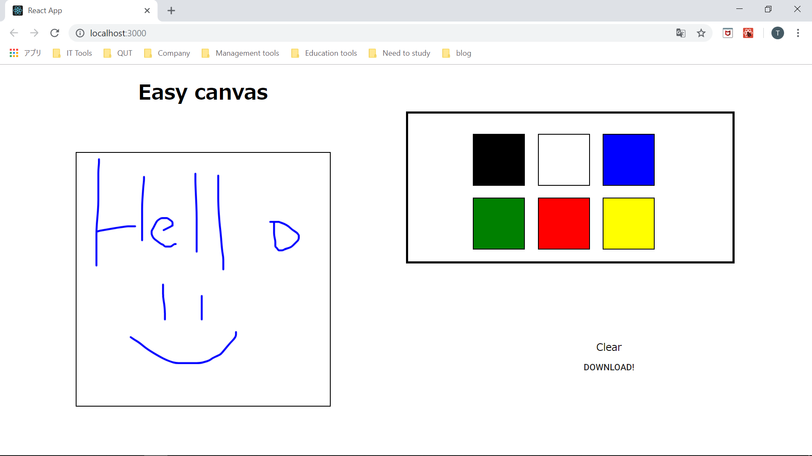

# Sketch

Practice application project created with React.

You can write whatever you want on the canvas with different colour and download as image:)



# Requrement

You require [npm](https://nodejs.org/en/) to use this application.

# Setup

## Install

```
git clone https://github.com/TaigaMatsumoto/Sketch.git
cd sketch
npm install
```

## Run

Run command below

```
npm start
```

As a default, the application runs on port 3000 so go to http://localhost:3000/

# Usage

This app is made for practice purpose. You can try sketch app:)
